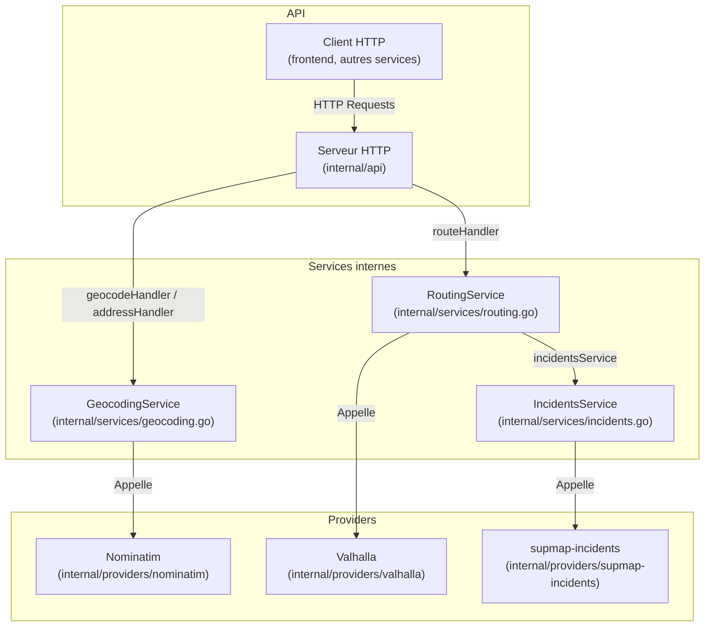

# supmap-gis

## 1. Introduction

Le microservice **supmap-gis** fournit des fonctionnalités avancées de traitement géographique pour l’écosystème Supmap : calcul d’itinéraires multimodaux, géocodage (et géocodage inverse), et prise en compte dynamique des incidents.

### 1.1. Rôles principaux

- **Exposer une API HTTP** : endpoints `/geocode`, `/address`, `/route`, `/health` via net/http (handlers personnalisés).
- **Routage multimodal** : calcul d’itinéraires avec options (type de véhicule, exclusions dynamiques, alternatives…).
- **Géocodage** : conversion d’adresses en coordonnées GPS (et inversement).
- **Prise en compte des incidents** : intégration du service interne supmap-incidents pour éviter des routes lors du calcul d’itinéraires.

### 1.2. Fonctionnement général

- **Entrée principale** : `cmd/api/main.go`
  - Instancie la configuration, le logger, les clients HTTP externes (Nominatim, Valhalla, supmap-incidents).
  - Compose les services métiers : GeocodingService, IncidentsService, RoutingService, injectés au serveur HTTP.
  - Lance l’API HTTP via `internal/api/server.go` (serveur, routing, doc Swagger).

- **Handlers HTTP** : `internal/api/handlers.go`
  - Chaque endpoint a un handler dédié, qui :
    - Valide les paramètres ou le corps de la requête.
    - Appelle le service métier correspondant.
    - Formate la réponse ou l’erreur.

- **Services métiers** : `internal/services/`
  - **GeocodingService** : encapsule les appels à Nominatim, standardise les résultats.
  - **RoutingService** : orchestre le calcul d’itinéraire avec Valhalla, l’enrichit en excluant dynamiquement les routes touchées par des incidents bloquants via IncidentsService.
  - **IncidentsService** : interroge supmap-incidents pour identifier les points à éviter.
  - **Polyline decoding utilitaire** : interprète les polylines Valhalla (tracé des trajets).

- **Providers** : `internal/providers/`
  - Clients HTTP spécialisés pour : Valhalla (routing), Nominatim (géocodage), supmap-incidents (incidents).

### 1.3. Technologies et principes d’architecture

- **Go natif** : `net/http`, pas de framework tiers lourd. On utilise la librairie standard.
- **Injection de dépendances explicite** : chaque service reçoit ses clients et dépendances à l’instanciation.
- **Découplage fort** : chaque handler et service métier a une responsabilité claire, testable et extensible.
- **Contrôle des erreurs centralisé** : propagation explicite des erreurs vers le handler HTTP.

---

## 2. Architecture générale

### 2.1. Schéma d’architecture



### 2.2. Description des interactions internes et externes

- **Entrée dans le service** :  
  Les requêtes HTTP arrivent sur le serveur (`internal/api/server.go`).  
  Chaque endpoint (`/geocode`, `/address`, `/route`, `/health`) possède un handler dédié dans `internal/api/handlers.go`.

- **Géocodage** :  
  Les handlers `/geocode` et `/address` font appel au `GeocodingService`. Celui-ci délègue les requêtes à un client Nominatim (provider interne) pour exécuter le géocodage direct ou inverse. Les résultats sont formatés et renvoyés au client.

- **Routage** :  
  Le handler `/route` utilise le `RoutingService`.  
  Avant de lancer le calcul d’itinéraire, ce service :
    1. Demande au `IncidentsService` si des incidents sont présents autour des points de passage (via le provider supmap-incidents).
    2. Exclut dynamiquement ces zones du calcul d’itinéraire.
    3. Lance la requête de routage auprès du provider Valhalla.
    4. Formate et retourne la réponse.

- **Gestion des incidents** :  
  Le service `IncidentsService` encapsule la logique d’appel à l’API supmap-incidents :  
  Il calcule un cercle englobant tous les points de départ/d’arrivée/intermédiaires et interroge le provider pour obtenir la liste des incidents à proximité.

- **Configuration et initialisation** :  
  Le point d’entrée (`cmd/api/main.go`) :
    - Charge la configuration (`internal/config`)
    - Instancie les clients providers (Nominatim, Valhalla, supmap-incidents)
    - Compose les services métiers
    - Instancie le serveur HTTP

### 2.3. Présentation des principaux composants

- **Serveur HTTP (`internal/api/server.go`)**
    - Démarre le serveur, gère le routage des endpoints, fournit la documentation Swagger.
    - Injecte les services métiers nécessaires aux handlers.

- **Handlers HTTP (`internal/api/handlers.go`)**
    - Orchestrent la validation des entrées, l’appel aux services métiers et la gestion des erreurs/réponses.

- **Services métiers (`internal/services/`)**
    - `GeocodingService` : Encapsule la logique de géocodage via Nominatim.
    - `RoutingService` : Gère le calcul d’itinéraires, l’intégration des incidents, la transformation des réponses Valhalla.
    - `IncidentsService` : Calcule la zone à surveiller, interroge supmap-incidents, filtre les incidents pertinents qui nécessitent d'être évités.

- **Providers (`internal/providers/`)**
    - Contiennent les clients HTTP pour chaque service externe :
        - Nominatim (géocodage)
        - Valhalla (routage)
        - supmap-incidents (incidents)

- **Configuration (`internal/config`)**
    - Centralise la configuration du service (ports, hôtes, etc.).

---

## 3. Organisation du projet et Structure des dossiers

Le projet est organisé selon une architecture claire et modulaire inspirée des standards Go, favorisant la séparation des responsabilités et la testabilité.

### 3.1 Arborescence commentée (niveaux principaux)

```
supmap-gis/
├── cmd/
│   └── api/                 # Point d'entrée du service (main.go)
├── internal/
│   ├── api/                 # Serveur HTTP, routing, handlers et middlewares
│   ├── config/              # Chargement et validation de la configuration (variables d'environnement)
│   ├── providers/           # Clients pour services externes (Valhalla, Nominatim, supmap-incidents)
│   └── services/            # Logique métier (géocodage, routage, incidents, utilitaires)
├── go.mod / go.sum          # Dépendances Go
├── Dockerfile               # Déploiement containerisé
└── ...                      # Autres fichiers (docs, configs, CI, etc.)
```

### 3.2 Rôle de chaque dossier/fichier principal

- **cmd/api/**  
  Contient le point d’entrée du microservice (`main.go`).

- **internal/api/**
    - Définit le serveur HTTP, le routing (association endpoints/handlers), la gestion du CORS, la documentation Swagger.
    - Fichiers clés :
        - `server.go` : instanciation du serveur, mapping des routes
        - `handlers.go` : logique des endpoints (`/geocode`, `/address`, `/route`, `/health`)
        - `middleware.go` : middlewares, ex : gestion CORS

- **internal/config/**
    - Centralise le chargement et la validation de la configuration (hôtes, ports des providers, etc.)
    - Permet l’utilisation de variables d’environnement

- **internal/providers/**
    - Implémente un client HTTP pour chaque service tiers ou interne :
        - `nominatim/` : géocodage/adressage
        - `valhalla/` : routage
        - `supmap-incidents/` : incidents routiers

- **internal/services/**
    - Regroupe la logique métier :
        - `geocoding.go` : intégration et adaptation des résultats Nominatim
        - `routing.go` : orchestration du calcul d’itinéraire via Valhalla, gestion dynamique des exclusions (incidents)
        - `incidents.go` : interrogation et filtrage des incidents pertinents
        - `polyline.go` : utilitaires de décodage de polylines Valhalla

- **go.mod / go.sum**  
  Gestion des dépendances et de la version Go du projet.

---

