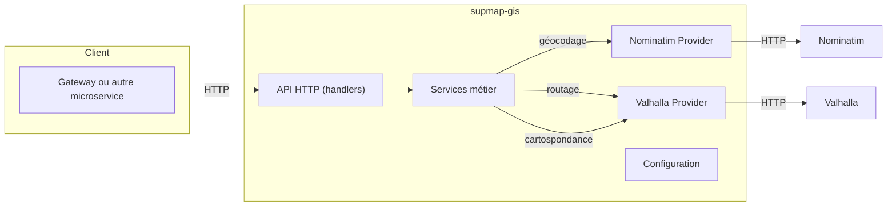

# supmap-gis

Microservice de calcul d’itinéraires, de géocodage et de cartospondance pour Supmap.

---

## Présentation

**supmap-gis** est un microservice écrit en Go destiné à fournir des fonctionnalités de système d’information géographique (GIS) pour l'application Supmap.  
Il expose des endpoints HTTP pour :
- le géocodage (conversion adresse ⇄ coordonnées)
- le calcul d’itinéraires multimodaux (en voiture, vélo, piéton, etc.)
- la cartospondance ([map matching](https://fr.wikipedia.org/wiki/Cartospondance)) — en cours d’implémentation

Il s’appuie sur les services open source [Valhalla](https://github.com/valhalla/valhalla) (routage, cartospondance) et [Nominatim](https://nominatim.org/) (géocodage).

---

## Architecture



---

## Structure du projet

```
supmap-gis/
├── cmd/api/             # Point d'entrée du microservice (main.go)
├── internal/
│   ├── api/             # Endpoints HTTP, server, handlers
│   ├── config/          # Chargement de la configuration
│   ├── domain/
│   │   └── services/    # Logique métier (routage, géocodage, cartospondance)
│   └── providers/
│       ├── nominatim/   # Client Nominatim
│       └── valhalla/    # Client Valhalla
├── Dockerfile           # Image Docker du microservice
├── go.mod / go.sum      # Dépendances Go
└── README.md
```

---

## Prérequis & Installation

- Go 1.24
- [Valhalla](https://github.com/valhalla/valhalla) et [Nominatim](https://nominatim.org/) accessibles en HTTP
- Docker/podman

### Démarrage rapide

```bash
# Cloner le repo
git clone https://github.com/4PROJ-Le-projet-d-une-vie/supmap-gis.git
cd supmap-gis

# Démarrer le service (nécessite les variables d'environnement, voir ci-dessous)
go run ./cmd/api
```

### Avec Docker

```bash
docker pull ghcr.io/4proj-le-projet-d-une-vie/supmap-gis:latest
docker run --env-file .env -p 8080:80 supmap-gis
```

#### Authentification

Pour pull l'image, il faut être authentifié par `docker login`.

* Générer un Personal Access Token sur GitHub :
   * Se rendre sur https://github.com/settings/tokens
   * Cliquer sur "Generate new token"
   * Cocher au minimum la permission `read:packages`
   * Copier le token
* Connecter Docker à GHCR avec le token :

````bash
echo 'YOUR_GITHUB_TOKEN' | docker login ghcr.io -u YOUR_GITHUB_USERNAME --password-stdin
````

---

## Configuration

La configuration se fait via variables d’environnement ou un fichier `.env` :

| Variable              | Description                             |
|-----------------------|-----------------------------------------|
| `APISERVER_HOST`      | Adresse d'écoute de l’API               |
| `APISERVER_PORT`      | Port d’écoute de l’API                  |
| `NOMINATIM_HOST`      | Hôte du service Nominatim               |
| `NOMINATIM_PORT`      | Port du service Nominatim               |
| `VALHALLA_HOST`       | Hôte du service Valhalla                |
| `VALHALLA_PORT`       | Port du service Valhalla                |

---

## Endpoints

### Healthcheck

```http
GET /health
```
Renvoie `200 OK` si le service est prêt.

---

### Géocodage

```http
GET /geocode?address=Mon+Adresse
```
Réponse :
```json
{
  "data": [
    { "lat": 49.123, "lon": -0.12, "name": "Nom", "display_name": "Nom complet" }
  ],
  "message": "success"
}
```

---

### Calcul d’itinéraire

```http
POST /route
Content-Type: application/json

{
  "locations": [
    { "lat": 49.20, "lon": -0.39, "name": "Départ" },
    { "lat": 49.18, "lon": -0.35, "name": "Arrivée" }
  ],
  "costing": "auto",
  "costing_options": { "use_highways": 0 }
}
```

Paramètres par défaut :
- `language`: `"fr-FR"`
- `alternates`: `2`

Réponse :
```json
{
  "data": [
    {
      "locations": [...],
      "legs": [...],
      "summary": {...}
    }
  ],
  "message": "success"
}
```

---

### Cartospondance (map matching) *(En cours d'implémentation)*

```http
POST /match
Content-Type: application/json

{
  "shape": [
    { "lat": 49.201, "lon": -0.393 },
    { "lat": 49.187, "lon": -0.348 }
  ],
  "costing": "auto"
}
```

Réponse attendue :
```json
{
  "data": {
    "matched_path": [...],
    "summary": {...}
  },
  "message": "success"
}
```
> **NB :** L’API, la structure de la requête et la réponse peuvent évoluer lors de l’implémentation.

---
