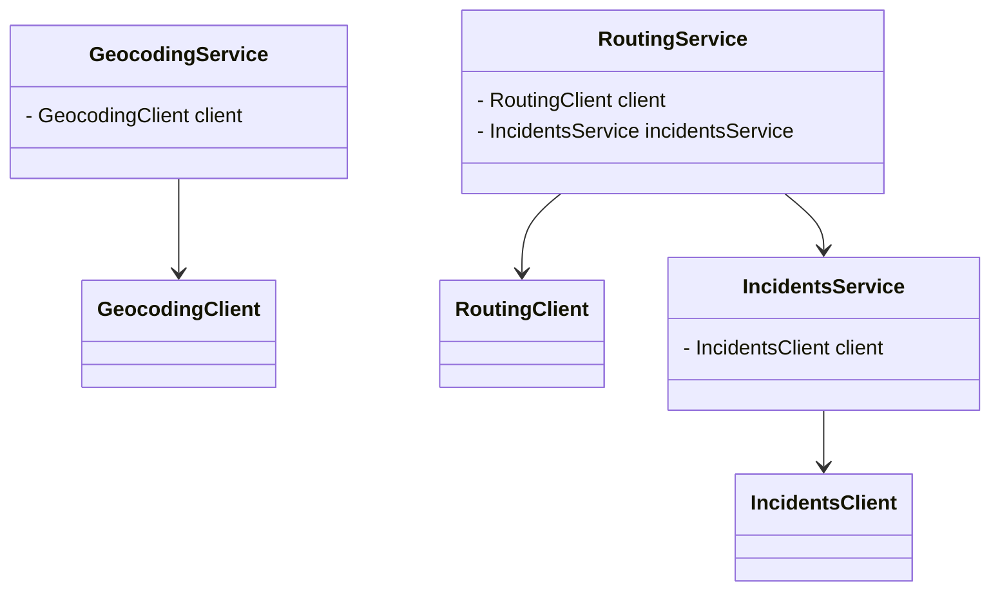
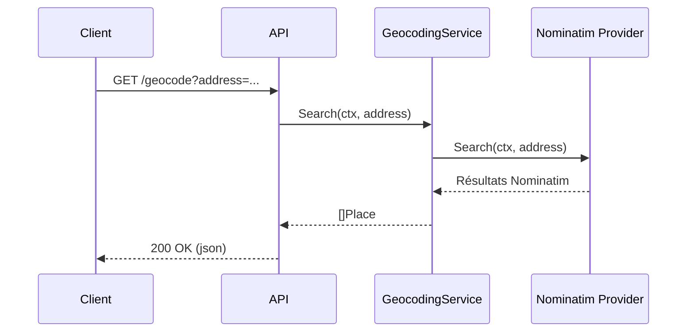
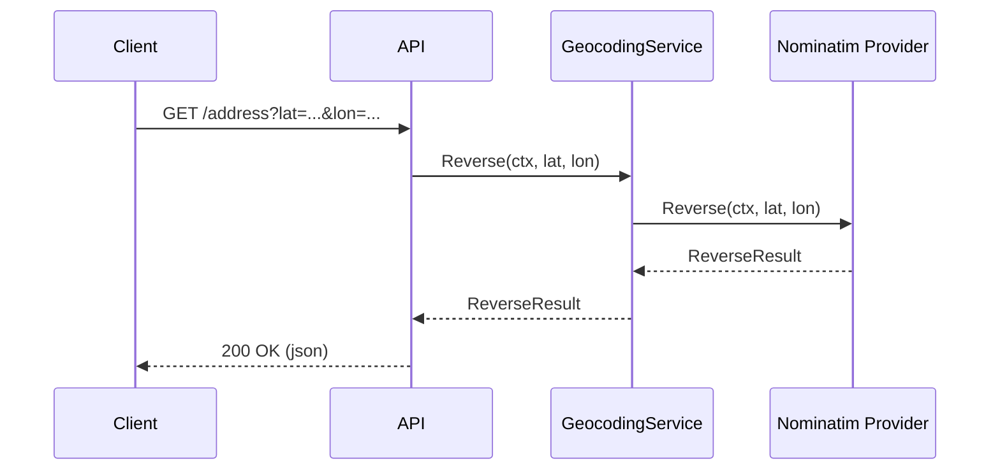
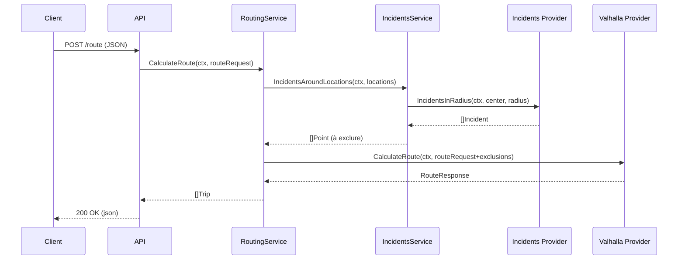

# supmap-gis

## 1. Introduction

Le microservice **supmap-gis** fournit des fonctionnalités avancées de traitement géographique pour l’écosystème Supmap : calcul d’itinéraires multimodaux, géocodage (et géocodage inverse), et prise en compte dynamique des incidents.

### 1.1. Rôles principaux

- **Exposer une API HTTP** : endpoints `/geocode`, `/address`, `/route`, `/health` via net/http (handlers personnalisés).
- **Routage multimodal** : calcul d’itinéraires avec options (type de véhicule, exclusions dynamiques, alternatives…).
- **Géocodage** : conversion d’adresses en coordonnées GPS (et inversement).
- **Prise en compte des incidents** : intégration du service interne supmap-incidents pour éviter des routes lors du calcul d’itinéraires.

### 1.2. Fonctionnement général

- **Entrée principale** : `cmd/api/main.go`
  - Instancie la configuration, le logger, les clients HTTP externes (Nominatim, Valhalla, supmap-incidents).
  - Compose les services métiers : GeocodingService, IncidentsService, RoutingService, injectés au serveur HTTP.
  - Lance l’API HTTP via `internal/api/server.go` (serveur, routing, doc Swagger).

- **Handlers HTTP** : `internal/api/handlers.go`
  - Chaque endpoint a un handler dédié, qui :
    - Valide les paramètres ou le corps de la requête.
    - Appelle le service métier correspondant.
    - Formate la réponse ou l’erreur.

- **Services métiers** : `internal/services/`
  - **GeocodingService** : encapsule les appels à Nominatim, standardise les résultats.
  - **RoutingService** : orchestre le calcul d’itinéraire avec Valhalla, l’enrichit en excluant dynamiquement les routes touchées par des incidents bloquants via IncidentsService.
  - **IncidentsService** : interroge supmap-incidents pour identifier les points à éviter.
  - **Polyline decoding utilitaire** : interprète les polylines Valhalla (tracé des trajets).

- **Providers** : `internal/providers/`
  - Clients HTTP spécialisés pour : Valhalla (routing), Nominatim (géocodage), supmap-incidents (incidents).

### 1.3. Technologies et principes d’architecture

- **Go natif** : `net/http`, pas de framework tiers lourd. On utilise la librairie standard.
- **Injection de dépendances explicite** : chaque service reçoit ses clients et dépendances à l’instanciation.
- **Découplage fort** : chaque handler et service métier a une responsabilité claire, testable et extensible.
- **Contrôle des erreurs centralisé** : propagation explicite des erreurs vers le handler HTTP.

---

## 2. Architecture générale

### 2.1. Schéma d’architecture


### 2.2. Description des interactions internes et externes

- **Entrée dans le service** :  
  Les requêtes HTTP arrivent sur le serveur (`internal/api/server.go`).  
  Chaque endpoint (`/geocode`, `/address`, `/route`, `/health`) possède un handler dédié dans `internal/api/handlers.go`.

- **Géocodage** :  
  Les handlers `/geocode` et `/address` font appel au `GeocodingService`. Celui-ci délègue les requêtes à un client Nominatim (provider interne) pour exécuter le géocodage direct ou inverse. Les résultats sont formatés et renvoyés au client.

- **Routage** :  
  Le handler `/route` utilise le `RoutingService`.  
  Avant de lancer le calcul d’itinéraire, ce service :
    1. Demande au `IncidentsService` si des incidents sont présents autour des points de passage (via le provider supmap-incidents).
    2. Exclut dynamiquement ces zones du calcul d’itinéraire.
    3. Lance la requête de routage auprès du provider Valhalla.
    4. Formate et retourne la réponse.

- **Gestion des incidents** :  
  Le service `IncidentsService` encapsule la logique d’appel à l’API supmap-incidents :  
  Il calcule un cercle englobant tous les points de départ/d’arrivée/intermédiaires et interroge le provider pour obtenir la liste des incidents à proximité.

- **Configuration et initialisation** :  
  Le point d’entrée (`cmd/api/main.go`) :
    - Charge la configuration (`internal/config`)
    - Instancie les clients providers (Nominatim, Valhalla, supmap-incidents)
    - Compose les services métiers
    - Instancie le serveur HTTP

### 2.3. Présentation des principaux composants

- **Serveur HTTP (`internal/api/server.go`)**
    - Démarre le serveur, gère le routage des endpoints, fournit la documentation Swagger.
    - Injecte les services métiers nécessaires aux handlers.

- **Handlers HTTP (`internal/api/handlers.go`)**
    - Orchestrent la validation des entrées, l’appel aux services métiers et la gestion des erreurs/réponses.

- **Services métiers (`internal/services/`)**
    - `GeocodingService` : Encapsule la logique de géocodage via Nominatim.
    - `RoutingService` : Gère le calcul d’itinéraires, l’intégration des incidents, la transformation des réponses Valhalla.
    - `IncidentsService` : Calcule la zone à surveiller, interroge supmap-incidents, filtre les incidents pertinents qui nécessitent d'être évités.

- **Providers (`internal/providers/`)**
    - Contiennent les clients HTTP pour chaque service externe :
        - Nominatim (géocodage)
        - Valhalla (routage)
        - supmap-incidents (incidents)

- **Configuration (`internal/config`)**
    - Centralise la configuration du service (ports, hôtes, etc.).

---

## 3. Organisation du projet et Structure des dossiers

Le projet est organisé selon une architecture claire et modulaire inspirée des standards Go, favorisant la séparation des responsabilités et la testabilité.

### 3.1 Arborescence commentée (niveaux principaux)

```
supmap-gis/
├── cmd/
│   └── api/                 # Point d'entrée du service (main.go)
├── internal/
│   ├── api/                 # Serveur HTTP, routing, handlers et middlewares
│   ├── config/              # Chargement et validation de la configuration (variables d'environnement)
│   ├── providers/           # Clients pour services externes (Valhalla, Nominatim, supmap-incidents)
│   └── services/            # Logique métier (géocodage, routage, incidents, utilitaires)
├── go.mod / go.sum          # Dépendances Go
├── Dockerfile               # Déploiement containerisé
└── ...                      # Autres fichiers (docs, configs, CI, etc.)
```

### 3.2 Rôle de chaque dossier/fichier principal

- **cmd/api/**  
  Contient le point d’entrée du microservice (`main.go`).

- **internal/api/**
    - Définit le serveur HTTP, le routing (association endpoints/handlers), la gestion du CORS, la documentation Swagger.
    - Fichiers clés :
        - `server.go` : instanciation du serveur, mapping des routes
        - `handlers.go` : logique des endpoints (`/geocode`, `/address`, `/route`, `/health`)
        - `middleware.go` : middlewares, ex : gestion CORS

- **internal/config/**
    - Centralise le chargement et la validation de la configuration (hôtes, ports des providers, etc.)
    - Permet l’utilisation de variables d’environnement

- **internal/providers/**
    - Implémente un client HTTP pour chaque service tiers ou interne :
        - `nominatim/` : géocodage/adressage
        - `valhalla/` : routage
        - `supmap-incidents/` : incidents routiers

- **internal/services/**
    - Regroupe la logique métier :
        - `geocoding.go` : intégration et adaptation des résultats Nominatim
        - `routing.go` : orchestration du calcul d’itinéraire via Valhalla, gestion dynamique des exclusions (incidents)
        - `incidents.go` : interrogation et filtrage des incidents pertinents
        - `polyline.go` : utilitaires de décodage de polylines Valhalla

- **go.mod / go.sum**  
  Gestion des dépendances et de la version Go du projet.

---

## 4. Détail des services internes

Cette section présente le fonctionnement interne des principaux services métier.

### 4.1. GeocodingService

- **Rôle** :  
  Fournit les opérations de géocodage direct (adresse → coordonnées) et inverse (coordonnées → adresse "humaine").  
  Sert d’interface métier entre l’API et le provider Nominatim, en standardisant et en validant les résultats.

- **Dépendances** :
    - Client Nominatim (via l’interface `GeocodingClient`)

- **Principales méthodes**
    - `Search(ctx, address string) ([]Place, error)`  
      → Appelle le provider, convertit et filtre les résultats Nominatim.  
      → Retourne une liste de structures Place (lat, lon, nom, display_name).
    - `Reverse(ctx, lat, lon float64) (*nominatim.ReverseResult, error)`  
      → Géocodage inverse, retourne la structure ReverseResult du provider.

### 4.2. RoutingService

- **Rôle** :  
  Orchestration complète du calcul d’itinéraire :
    - Prise en compte des incidents à proximité (“zones à éviter” dynamiques)
    - Appel du provider Valhalla
    - Transformation et enrichissement de la réponse pour l’API (legs, summary, shape, alternatives…)

- **Dépendances** :
    - Client Valhalla (`RoutingClient`)
    - `IncidentsService` (pour lister les incidents autour du trajet)

- **Principales méthodes**
    - `CalculateRoute(ctx, routeRequest valhalla.RouteRequest) (*[]Trip, error)`  
      → Extrait les points du trajet, interroge `IncidentsService`, enrichit la requête Valhalla en excluant les points à risque, appelle Valhalla, convertit la réponse (trips, legs, summary…)
    - Fonctions d’adaptation (“mapping”) :
        - `MapValhallaTrip(vt valhalla.Trip) (*Trip, error)`
        - `mapValhallaLeg(vl valhalla.Leg) (*Leg, error)`
          → Transformations détaillées du format Valhalla vers les DTO internes.

### 4.3. IncidentsService

- **Rôle** :  
  Fournit la liste des incidents routiers à prendre en compte lors du calcul d’itinéraire, selon les points de passage du trajet.  
  Calcule un cercle englobant (“bounding circle”) autour des points et interroge le provider supmap-incidents.

- **Dépendances** :
    - Client supmap-incidents (`IncidentsClient`)

- **Principales méthodes**
    - `IncidentsAroundLocations(ctx, locations []Point) []Point`  
      → Calcule le centre et le rayon optimaux, appelle le provider, filtre les incidents pertinents nécessitant d’être évités.
    - Fonctions utilitaires privées :
        - `computeLocationsBoundingCircle(locations []Point) (centerLat, centerLon, radius)`
        - `haversine(lat1, lon1, lat2, lon2 float64) float64` (pour la distance sphérique)

### 4.4. Résumé des dépendances

- **GeocodingService** → Client Nominatim
- **RoutingService** → Client Valhalla, IncidentsService
- **IncidentsService** → Client supmap-incidents

L’instanciation des services se fait dans le `main.go`, chaque service recevant explicitement ses dépendances (découplage fort, testabilité).

Chaque service expose uniquement les méthodes nécessaires à ses usages métier, en cachant la complexité des providers et en garantissant un formatage homogène pour l’API.

---

## 5. Endpoints HTTP exposés

### 5.1. Tableau récapitulatif

| Méthode | Chemin   | Description fonctionnelle                           |
|---------|----------|-----------------------------------------------------|
| GET     | /geocode | Géocodage d’une adresse (adresse → coordonnées)     |
| GET     | /address | Géocodage inverse (coordonnées → adresse)           |
| POST    | /route   | Calcul d’itinéraire multimodal avec exclusions      |
| GET     | /health  | (Non documenté ici, endpoint de liveness/readiness) |


### 5.2. Détails des endpoints

#### 5.2.1. `/geocode` — Géocodage d’adresse

- **Méthode + chemin**  
  `GET /geocode`

- **Description fonctionnelle**  
  Convertit une adresse “humaine” en coordonnées GPS. Retourne une liste de résultats possibles (lat, lon, nom…).

- **Paramètres attendus**
    - Query : `address` (obligatoire) — l’adresse à géocoder

- **Exemple de requête**
  ```
  GET /geocode?address=Abbaye aux Dames Caen
  ```

- **Exemple de réponse**
  ```json
  {
    "data": [
      {
        "lat": 49.1864,
        "lon": -0.3608,
        "name": "Abbaye aux Dames",
        "display_name": "Abbaye aux Dames, Caen, France"
      },
      ...
    ],
    "message": "success"
  }
  ```

- **Description du flux de traitement**
    - Vérification du paramètre `address` (400 si manquant)
    - Appel à `GeocodingService.Search()`
    - Conversion et formatage des résultats
    - Retour HTTP 200 avec la liste (vide si aucun résultat) ou 500 en cas d’erreur


#### 5.2.2. `/address` — Géocodage inverse

- **Méthode + chemin**  
  `GET /address`

- **Description fonctionnelle**  
  Retourne l’adresse “humaine” la plus proche pour des coordonnées GPS fournies.

- **Paramètres attendus**
    - Query : `lat` (obligatoire, float, ex: 49.0677)
    - Query : `lon` (obligatoire, float, ex: -0.6658)

- **Exemple de requête**
  ```
  GET /address?lat=49.0677&lon=-0.6658
  ```

- **Exemple de réponse**
  ```json
  {
    "display_name": "Place de la Gare, Caen, France"
  }
  ```

- **Description du flux de traitement**
    - Vérification des paramètres `lat` et `lon` (400 si manquant)
    - Appel à `GeocodingService.Reverse()`
    - Extraction du champ `display_name` du premier résultat
    - Retour 200 avec l’adresse, 404 si aucune trouvée


#### 5.2.3. `/route` — Calcul d’itinéraire multimodal

- **Méthode + chemin**  
  `POST /route`

- **Description fonctionnelle**  
  Calcule l’itinéraire optimal selon un ensemble de points, le profil de déplacement, et les incidents à éviter (prise en compte dynamique des exclusions). Peut proposer des itinéraires alternatifs.

- **Paramètres attendus**
    - Body (JSON) :
        - `locations` (obligatoire, array) : liste d’objets `{lat, lon}` (au moins 2)
        - `costing` (obligatoire, string) : mode de transport (`auto`, `bicycle`, etc.)
        - `exclude_locations` (optionnel) : coordonnées à éviter (normalement gérées automatiquement)
        - `costing_options` (optionnel, objet) : options permettant d'éviter les péages, les ferries et les autoroutes
        - `language` (optionnel, string, défaut `fr-FR`) : langue des instructions
        - `alternates` (optionnel, int, défaut 2)

- **Exemple de requête**
  ```json
  POST /route
  {
    "costing": "auto",
    "costing_options": {
      "use_tolls": 0
    },
    "locations": [
      {"lat": 49.1864, "lon": -0.3608},
      {"lat": 49.0677, "lon": -0.6658}
    ]
  }
  ```

- **Exemple de réponse**
  ```json
  {
    "data": [
      {
        "locations": [...],
        "legs": [
          {
            "maneuvers": [
              {"instruction": "Prendre à droite", ...}
            ],
            "summary": {"length": 8.2, "time": 740},
            "shape": [
              {"lat": 49.18, "lon": -0.36},
              ...
            ]
          }
        ],
        "summary": {"length": 8.2, "time": 740}
      }
    ],
    "message": "success"
  }
  ```

- **Description du flux de traitement**
    - Décodage et validation du body JSON (locations >= 2, costing valide…)
    - Conversion en requête Valhalla
    - Appel à `RoutingService.CalculateRoute()`
        - Appel à `IncidentsService` pour exclure dynamiquement les incidents
        - Appel au provider Valhalla
        - Mapping du résultat (legs, maneuvers, summary…)
    - Retour 200 avec la liste des itinéraires ou 500 en cas d’erreur


---

## 6. Structures & interfaces importantes

Cette section synthétise les structures et interfaces clés du projet, en complément des détails déjà vus sur les endpoints et services. Elle se concentre sur la modélisation métier, l’API, et le découplage via interfaces. (Les détails des champs sont volontairement réduits pour éviter la redite.)

---

### 6.1. Structures principales

#### 6.1.1. Entités métier

- **Place**
    - Représente un résultat de géocodage (lat, lon, nom, display_name).
- **Trip / Leg / Maneuver / Summary**
    - Décomposent un itinéraire : un Trip regroupe une ou plusieurs Leg (tronçons), chacune contenant des Maneuver (instructions) et un résumé (Summary).
- **Point**
    - Simple couple latitude/longitude utilisé dans plusieurs contextes (requêtes, incidents, polylines…).

#### 6.1.2. Structures de requête/réponse API

- **RouteRequest**
    - Body de `/route`. Contient : `locations`, `costing`, `exclude_locations`, `costing_options`, `language`, `alternates`.
- **AddressResponse**
    - Réponse de `/address`. Champ unique : `display_name`.
- **handler.Response[T]**
    - Enveloppe générique standardisant les réponses JSON (champ `data` et `message`).

### 6.2. Interfaces clés

#### 6.2.1. Interfaces de clients (Providers)

- **GeocodingClient**
    - `Search(ctx, address string) ([]GeocodeResult, error)`
    - `Reverse(ctx, lat, lon float64) (*ReverseResult, error)`
- **RoutingClient**
    - `CalculateRoute(ctx, routeRequest) (*RouteResponse, error)`
- **IncidentsClient**
    - `IncidentsInRadius(ctx, lat, lon, radius) ([]Incident, error)`

#### 6.2.2. Interfaces de services métiers

- **GeocodingService**
    - `Search`, `Reverse`
- **RoutingService**
    - `CalculateRoute`
- **IncidentsService**
    - `IncidentsAroundLocations`

Chacune de ces interfaces permet d’injecter des implémentations alternatives (mocks, doubles, providers réels…) pour les tests ou l’évolution du projet.

### 6.3. Diagramme des dépendances principales



> Les structures et interfaces sont conçues pour garantir un découplage fort, une testabilité maximale et une évolution facilitée du code métier et des intégrations externes.

---

## 7. Stack trace & appels typiques

Cette section détaille, pour chacun des endpoints principaux, la stack trace logique typique (ordre d’appel des fonctions/services), les signatures des fonctions clés, et fournit un diagramme de séquence synthétique pour la compréhension globale.

### 7.1. Stack trace typique : `/geocode` (GET)

**Stack trace (ordre d’appel)**

1. `Server.geocodeHandler()`
2. `GeocodingService.Search(ctx, address string) ([]Place, error)`
3. `GeocodingClient.Search(ctx, address string) ([]GeocodeResult, error)`

**Signatures principales**

- `func (s *Server) geocodeHandler() http.HandlerFunc`
- `func (s *GeocodingService) Search(ctx context.Context, address string) ([]Place, error)`
- `func (n *NominatimClient) Search(ctx context.Context, address string) ([]GeocodeResult, error)`

**Diagramme de séquence**



### 7.2. Stack trace typique : `/address` (GET)

**Stack trace (ordre d’appel)**

1. `Server.addressHandler()`
2. `GeocodingService.Reverse(ctx, lat, lon float64) (*ReverseResult, error)`
3. `GeocodingClient.Reverse(ctx, lat, lon float64) (*ReverseResult, error)`

**Signatures principales**

- `func (s *Server) addressHandler() http.HandlerFunc`
- `func (s *GeocodingService) Reverse(ctx context.Context, lat, lon float64) (*nominatim.ReverseResult, error)`
- `func (n *NominatimClient) Reverse(ctx context.Context, lat, lon float64) (*ReverseResult, error)`

**Diagramme de séquence**



---

### 7.3. Stack trace typique : `/route` (POST)

**Stack trace (ordre d’appel)**

1. `Server.routeHandler()`
2. `RoutingService.CalculateRoute(ctx, routeRequest valhalla.RouteRequest) (*[]Trip, error)`
3. `IncidentsService.IncidentsAroundLocations(ctx, locations []Point) []Point`
4. `IncidentsClient.IncidentsInRadius(ctx, lat, lon, radius) ([]Incident, error)`
5. `RoutingClient.CalculateRoute(ctx, routeRequest) (*RouteResponse, error)`
6. Mapping functions (`MapValhallaTrip`, etc.)

**Signatures principales**

- `func (s *Server) routeHandler() http.HandlerFunc`
- `func (s *RoutingService) CalculateRoute(ctx context.Context, routeRequest valhalla.RouteRequest) (*[]Trip, error)`
- `func (s *IncidentsService) IncidentsAroundLocations(ctx context.Context, locations []Point) []Point`
- `func (c *IncidentsClient) IncidentsInRadius(ctx context.Context, lat, lon float64, radius RadiusMeter) ([]Incident, error)`
- `func (c *ValhallaClient) CalculateRoute(ctx context.Context, req valhalla.RouteRequest) (*valhalla.RouteResponse, error)`

**Diagramme de séquence simplifié**



---
